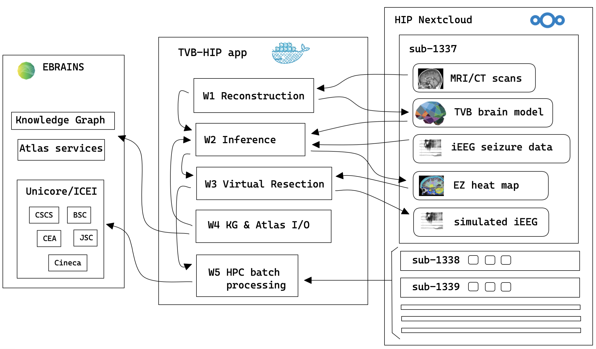

# HIP TVB app

This is a repo of software configuration and Jupyter notebooks for the TVB app on
the HIP platform, as part of HBP SGA3.  It is a work in progress, but the following
diagram shows the functional structure:

## TODO

- extend software support for all workflows
- split each software into its own dockerfile + setup-env.sh script
- implement an octopus merge for individual containers

may want to set up a castor vm to do the build process
just because internet is slow here..?
